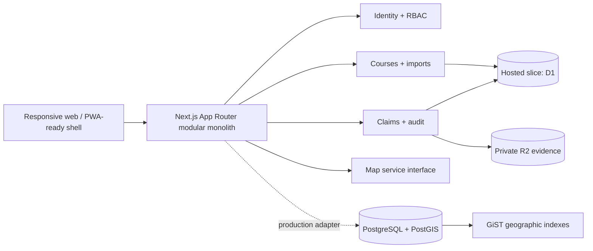

# Architecture

## Current shape

FlightForge begins as a TypeScript modular monolith using the Next.js App Router, React server/client components, Vinext, Cloudflare Workers compatibility, Zod contracts, Drizzle schemas, and domain-focused modules. The application avoids microservices while keeping provider boundaries explicit.

## Bounded modules implemented

| Module | Responsibility |
| --- | --- |
| `modules/auth` | Authenticated-user shape, demo session signing, roles, permissions |
| `modules/courses` | Course contracts, source-aware seed data, search, favorites, claims |
| `modules/imports` | Import normalization and duplicate candidates |
| `packages/database` | PostgreSQL/PostGIS schema, client, migration, seed |
| `packages/maps` | Provider-neutral directions and map-link contract |
| `lib/http` | Consistent non-leaking API errors and request IDs |
| `lib/security` | Origin checks, hashed D1 rate-limit keys, request client identity |
| `db` | Hosted first-slice D1/R2 bindings and schemas |

## Identity

Hosted Sites uses dispatch-owned sign-in and trusted identity headers. Local development can enable signed, HTTP-only demo sessions. Authorization is checked server-side on every write route. Exact hosted emails can be mapped to owner or platform-administrator roles with environment variables.

Demo authentication is not the future public account system. A public deployment outside Sites should integrate an established provider behind the same `AuthenticatedUser` contract.

## Persistence strategy

The production domain model targets PostgreSQL with PostGIS. It contains normalized identity, organization, course, source, geographic, favorite, claim, audit, import, and feature-flag tables. `course_locations.coordinates` is a PostGIS point with a GiST index.

The deployed first slice uses platform-backed D1 and private R2 so interactive favorites and claims work without browser storage. This operational adapter is intentionally narrower than the production schema. Wiring these write flows to the PostgreSQL client is still required before a standalone production launch.

## Feature modularity

Feature flags are seeded for discovery, claims, booking, scoring, AI, media coaching, and platform fees. Only discovery and claims are enabled. Core systems do not import AI code, preserving failure isolation for future providers.

## Mobile model

Desktop uses top navigation, split results, and management sidebars. Mobile uses a five-item bottom navigation with a central Play affordance, large targets, stacked cards, map/list controls, and thumb-reachable form actions. Offline scoring is not implemented in this slice.
