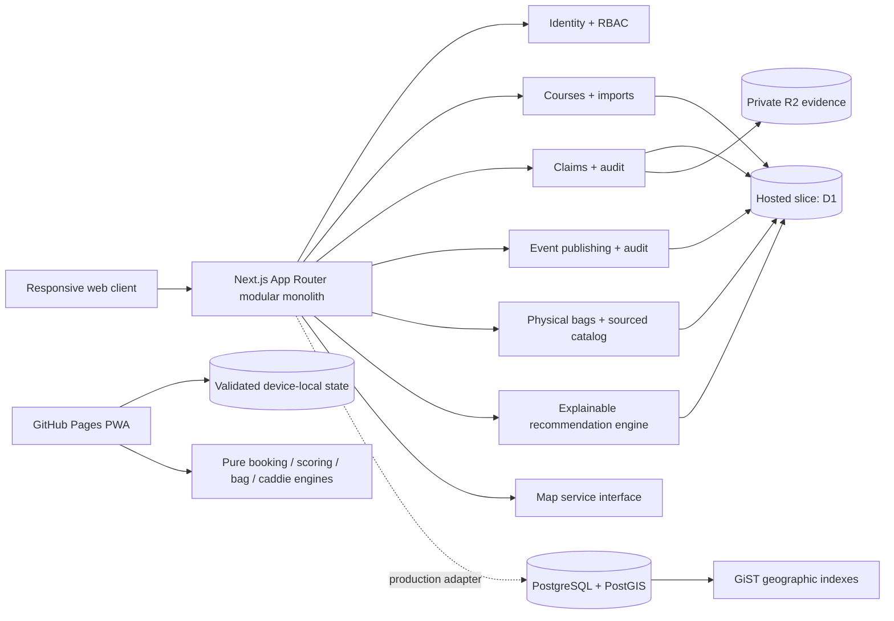

# Architecture

## Current shape

FlightForge begins as a TypeScript modular monolith using the Next.js App Router, React server/client components, Vinext, Cloudflare Workers compatibility, Zod contracts, Drizzle schemas, and domain-focused modules. The application avoids microservices while keeping provider boundaries explicit.

The virtual caddie is hybrid: deterministic owned-disc shot recommendations remain available without AI, while a provider-abstracted conversation layer can explain rules, flight, technique, and strategy using server-supplied bag context. See [CADDIE_AND_MAPS.md](./CADDIE_AND_MAPS.md) for provider, privacy, and deployment details.

## Bounded modules implemented

| Module | Responsibility |
| --- | --- |
| `modules/auth` | Authenticated-user shape, demo session signing, roles, permissions |
| `modules/courses` | Course contracts, source-aware seed data, search, favorites, claims |
| `modules/imports` | Import normalization and duplicate candidates |
| `modules/bookings` | Quote calculation, rule explanation, capacity, expiry, and idempotency |
| `modules/rounds` | Offline snapshots, optimistic versions, score corrections, and summaries |
| `modules/events` | Organizer-owned drafts/publication, public queries, lifecycle transitions, versions, and audits |
| `modules/discs` | Reviewed catalog contracts, provenance, and duplicate validation |
| `modules/bags` | Persistent physical inventory, versioned catalog linkage, private profiles, coverage, overlap, and missing-slot analysis |
| `modules/ai-caddie` | Deterministic, explainable owned-disc recommendations with calibrated confidence and physical/personal evidence |
| `modules/media-analysis` | Media metadata, consent, age, size, and processing-readiness gates |
| `packages/database` | PostgreSQL/PostGIS schema, client, migration, seed |
| `packages/maps` | Provider-neutral directions and map-link contract |
| `lib/http` | Consistent non-leaking API errors and request IDs |
| `lib/security` | Origin checks, hashed D1 rate-limit keys, request client identity |
| `db` | Hosted first-slice D1/R2 bindings and schemas |

## Identity

Hosted Sites uses dispatch-owned sign-in and trusted identity headers. Local development can enable signed, HTTP-only demo sessions. Authorization is checked server-side on every write route. Exact hosted emails can be mapped to owner or platform-administrator roles with environment variables.

Demo authentication is not the future public account system. A public deployment outside Sites should integrate an established provider behind the same `AuthenticatedUser` contract.

## Persistence strategy

The production domain model targets PostgreSQL with PostGIS. It currently contains normalized identity, organization, course, source, geographic, favorite, claim, audit, import, and feature-flag tables. `course_locations.coordinates` is a PostGIS point with a GiST index.

The deployed server slice uses platform-backed D1 and private R2 so accounts, profiles, favorites, claims, coordinator events, physical bags, catalog provenance, caddie sessions, and private disc profiles work without browser storage. D1 write paths enforce ownership, validation, rate limits, optimistic versions, and audit records. PostgreSQL/PostGIS remains the portability target for a future standalone deployment. The GitHub Pages adapter deliberately uses a separate versioned, Zod-validated browser record; it is isolated from production persistence and visibly labeled throughout the UI.

## Feature modularity

Feature flags are seeded for discovery, claims, booking, scoring, AI, media coaching, and platform fees. `digital_bag`, `ai_caddie`, and `event_publishing` are active runtime-controlled server features; missing or unavailable controls fail closed for writes. Core booking and scoring remain independent from any AI provider.

## Mobile model

Desktop uses top navigation, split results, and management workspaces. Mobile uses a five-item bottom navigation with a central Play affordance, large targets, stacked cards, map/list controls, and thumb-reachable score actions. Pages scorekeeping survives refreshes and browser offline mode; server synchronization is the next production persistence slice.
